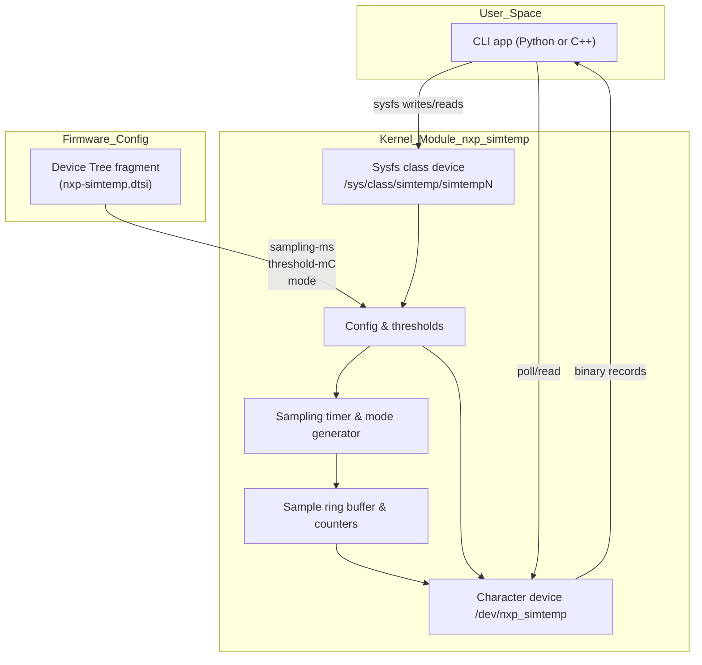

# simtemp Design Notes

This document tracks the evolving architecture of the simulated temperature stack and highlights portability considerations for both x86 development and ARM deployment targets.

## High-level structure

### Current status
- Timer-driven producer feeds a bounded FIFO; `/dev/nxp_simtemp` exposes packed `struct simtemp_sample` records with `POLLIN` (new sample) and `POLLPRI` (threshold) events.
- Sysfs configuration covers `sampling_ms`, `threshold_mC`, and `mode` (`normal|noisy|ramp`) plus `stats` counters (`updates/alerts/errors`). Invalid writes increment `errors` and emit warnings.
- Device Tree defaults (`sampling-ms`, `threshold-mC`, `mode`) are parsed during `probe()`, with clamping and fallbacks logged. A temporary platform device (`force_create_dev`) keeps x86 development snappy while DT overlays are drafted.
- Python CLI (`user/cli/main.py`) provides `stream` and `test` subcommands using `select.poll()`; non-blocking reads now swallow `EAGAIN`, preventing spurious failures when the ring drains between wakeups.
- Automation scripts: `build.sh` handles Secure Boot signing; `run_demo.sh` rebuilds on demand, loads, runs CLI stream/test, prints stats, and unloads.

### Portability verification (2025-10-04)
- Fedora 42 (6.16.8): `./scripts/build.sh` signs successfully; `./scripts/run_demo.sh` (stream/test) passes with stats.
- Orange Pi Zero3 (Armbian 25, 6.12.47): rebuilt against Armbian headers, overlay applied, `./scripts/run_demo.sh` passes (stats updates, errors=0). Secure Boot not enforced on board.
- Ubuntu 24.04.3 LTS cloud VM (6.8.0-85): `./scripts/build.sh` succeeds after switching apt sources to HTTPS; `./scripts/run_demo.sh` passes the stream/test sequence.
- Remaining work: optional hrtimer path for ≥1 kHz sampling and DKMS packaging for painless kernel upgrades.

## Portability strategy

- **x86 development**: continue using `force_create_dev=1` for rapid iteration against Fedora kernels (6.x). The build scripts already handle Secure Boot signing via enrolled MOK keys.
- **Orange Pi Zero3 (Armbian 25 / Ubuntu 24)**: install matching kernel headers, include `kernel/dts/nxp-simtemp.dtsi` in a board overlay, and rely on native DT probing instead of the forced platform device.
- **Jetson Orin Nano (JetPack 6.2 / Ubuntu 22)**: the NVIDIA kernel tree is based on LTS kernels; ensure the `class_create()` compatibility macro remains valid and sign modules per Jetson’s toolchain if Secure Boot is enabled.
- **Common API surface**: maintain `nxp_simtemp_ioctl.h` as the shared contract between kernel and CLI so record layouts remain consistent across architectures.
- **Testing parity**: reuse the sysfs + poll regression steps on every target. Capture results in `docs/TESTPLAN.md` once the CLI is online to flag any platform-specific anomalies.

## Next steps

1. Maintain the DT overlay (`kernel/dts/nxp-simtemp-overlay.dts`) on the Orange Pi Zero3 so the driver probes without `force_create_dev=1`, capturing results in TESTPLAN when rerun.
2. Explore high-rate sampling by swapping the legacy timer for `hrtimer`/high-resolution work, revisiting locking and buffer sizing for ≥1 kHz scenarios.
3. Package the module with DKMS to survive kernel upgrades, and wire the CLI/demo into CI once overlay support lands.
4. Finalise submission collateral: README links (repo/video), design narrative updates (locking, scaling), and git-send-email patch workflow.
