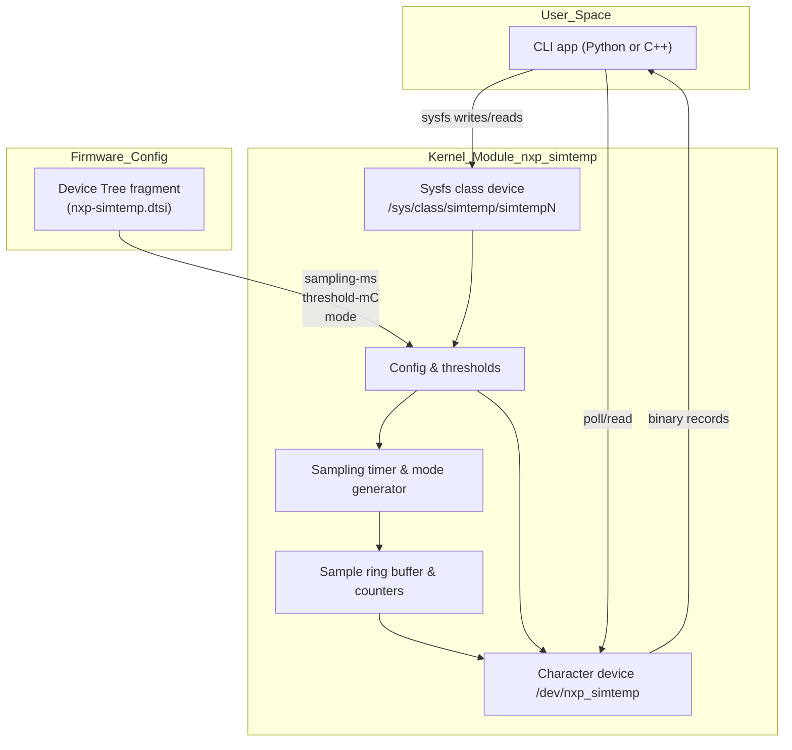

# simtemp Design Notes

This document tracks the evolving architecture of the simulated temperature stack and highlights portability considerations for both x86 development and ARM deployment targets.

## High-level structure

### Current status
- Timer-driven producer feeds a bounded FIFO; `/dev/nxp_simtemp` exposes packed `struct simtemp_sample` records with `POLLIN` (new sample) and `POLLPRI` (threshold) events.
- Sysfs configuration covers `sampling_ms`, `threshold_mC`, and `mode` (`normal|noisy|ramp`) plus `stats` counters (`updates/alerts/errors`). Invalid writes increment `errors` and emit warnings.
- Device Tree defaults (`sampling-ms`, `threshold-mC`, `mode`) are parsed during `probe()`, with clamping and fallbacks logged. A temporary platform device (`force_create_dev`) keeps x86 development snappy while DT overlays are drafted.
- Python CLI (`user/cli/main.py`) provides `stream` and `test` subcommands using `select.poll()`; non-blocking reads now swallow `EAGAIN`, preventing spurious failures when the ring drains between wakeups.
- Automation scripts: `build.sh` handles Secure Boot signing; `run_demo.sh` rebuilds on demand, loads, runs CLI stream/test, prints stats, and unloads.

### Verification status (2025-10-11)
- Fedora 42 (6.16.8 / 6.16.9): `./scripts/build.sh` signs successfully; `./scripts/run_demo.sh` (stream/test) passes; `pytest -vv` reports 17/17 CLI unit tests; 5 s run at `sampling_us=100` yielded ~5.6×10⁵ samples, `errors=0`.
- Orange Pi Zero3 (Armbian 25, 6.12.47): rebuilt against Armbian headers, configfs overlay applied, `./scripts/run_demo.sh` passes; worker thread produced ~2.8×10⁵ samples in 5 s at `sampling_us=100` with `errors=0`.
- Ubuntu 24.04.3 LTS cloud VM (6.8.0-85): `./scripts/build.sh` succeeds; worker stress at `sampling_us=100` produced ~3.1×10⁵ samples, `errors=0`; demo script passes.
- Raspberry Pi 4B (Armbian 6.12.44): module loads with `force_create_dev=1`; 5 s stream at `sampling_us=100` produced ~2.7×10⁵ samples, `errors=0`; demo script passes.
- Remaining work: tighten CI around the worker thread and explore dynamic ring sizing for future >10 kHz scenarios.

## Locking & API rationale

- **Mutex (`sim->lock`)** protects configuration fields (`sampling_ms`, `threshold_mC`, `mode`) across sysfs writes and DT parsing; these call paths can sleep, so we avoid spinlocks there.
- **Spinlock (`sim->buf_lock`)** guards the ring buffer head/tail, counters, and pending events in timer and read paths where we need short, IRQ-safe sections.
- **Sysfs vs ioctl**: configuration maps naturally to named attributes; sysfs keeps it discoverable/scriptable. This leaves ioctl for future batched control if needed.

## Portability strategy

- **x86 development**: continue using `force_create_dev=1` for rapid iteration against Fedora kernels (6.x). The build scripts already handle Secure Boot signing via enrolled MOK keys.
- **Orange Pi Zero3 (Armbian 25 / Ubuntu 24)**: install matching kernel headers, include `kernel/dts/nxp-simtemp.dtsi` in a board overlay, and rely on native DT probing instead of the forced platform device.
- **Raspberry Pi 4B (Raspberry Pi OS)**: rely on the included automation (`./scripts/run_demo.sh`) to build/load; no overlay required thanks to the temporary platform device.
- **Common API surface**: maintain `nxp_simtemp_ioctl.h` as the shared contract between kernel and CLI so record layouts remain consistent across architectures.
- **Testing parity**: reuse the sysfs + poll regression steps on every target. Capture results in `docs/TESTPLAN.md` once the CLI is online to flag any platform-specific anomalies.

## Submission readiness

All planned features for the challenge are implemented, validated, and documented across x86 and ARM targets. Remaining work is limited to packaging the submission collateral (README links, video, and git-send-email patch) per the instructions.
