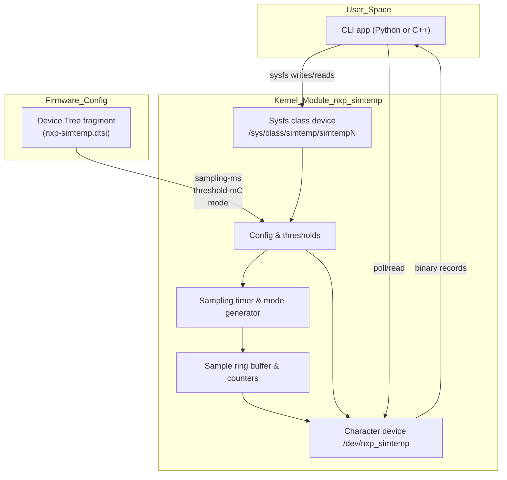

# simtemp Design Notes

This document tracks the evolving architecture of the simulated temperature stack and highlights portability considerations for both x86 development and ARM deployment targets.

## High-level structure

### Current status
- Timer-driven producer feeds a bounded FIFO; `/dev/nxp_simtemp` exposes packed `struct simtemp_sample` records with `POLLIN` (new sample) and `POLLPRI` (threshold) events.
- Sysfs configuration covers `sampling_ms`, `threshold_mC`, and new `mode` selector (`normal|noisy|ramp`) plus `stats` counters (`updates/alerts/errors`).
- Device Tree defaults (`sampling-ms`, `threshold-mC`, `mode`) are parsed during `probe()`, with clamping and fallbacks logged.

## Portability strategy

- **x86 development**: continue using `force_create_dev=1` for rapid iteration against Fedora kernels (6.x). The build scripts already handle Secure Boot signing via enrolled MOK keys.
- **Orange Pi Zero3 (Armbian 25 / Ubuntu 24)**: install matching kernel headers, include `kernel/dts/nxp-simtemp.dtsi` in a board overlay, and rely on native DT probing instead of the forced platform device.
- **Jetson Orin Nano (JetPack 6.2 / Ubuntu 22)**: the NVIDIA kernel tree is based on LTS kernels; ensure the `class_create()` compatibility macro remains valid and sign modules per Jetson’s toolchain if Secure Boot is enabled.
- **Common API surface**: maintain `nxp_simtemp_ioctl.h` as the shared contract between kernel and CLI so record layouts remain consistent across architectures.
- **Testing parity**: reuse the sysfs + poll regression steps on every target. Capture results in `docs/TESTPLAN.md` once the CLI is online to flag any platform-specific anomalies.

## Next steps

1. Build the user-space CLI to configure sysfs knobs, decode `struct simtemp_sample`, and validate alerts via `poll()`.
2. Codify regression tests (`docs/TESTPLAN.md`) covering mode changes, stats counters, and DT overrides on ARM targets.
3. Extend documentation with CLI usage + eventual demo video links; consider optional GUI/charting once CLI lands.
